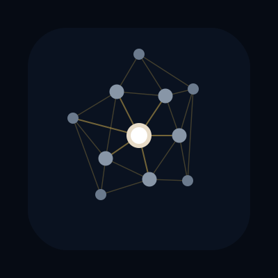
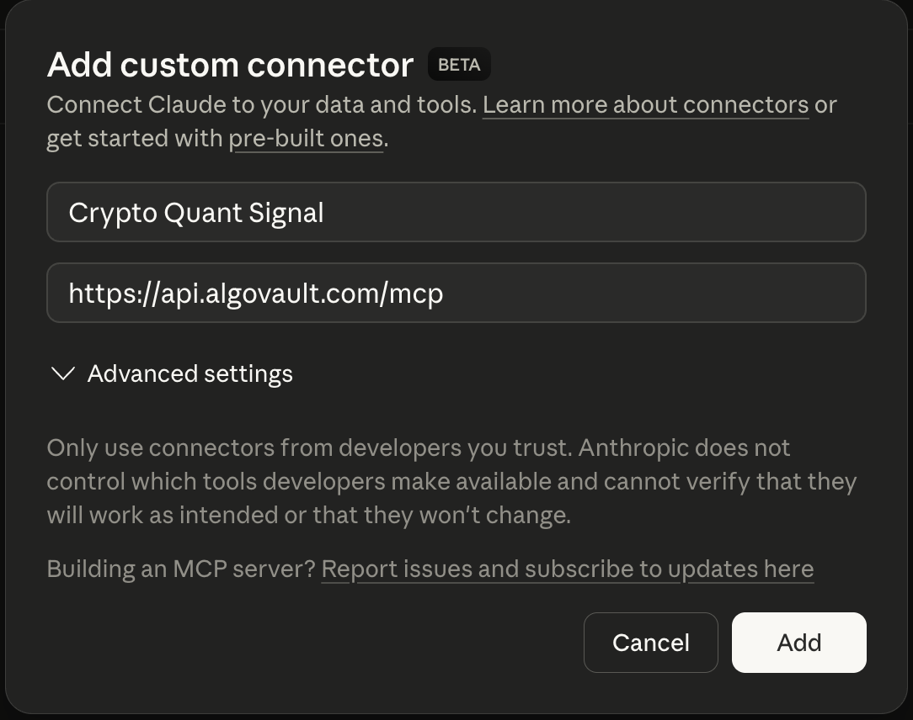
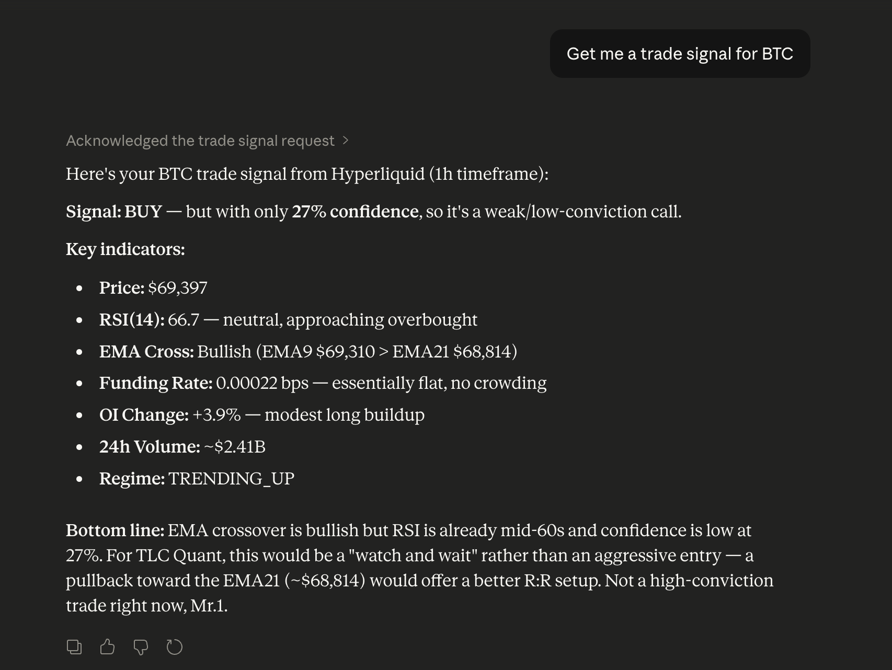

<p align="center">
  
</p>

# crypto-quant-signal-mcp

AI trading brain for crypto perps — composite signals, funding rate arb scanning, and market regime detection via MCP.

[](https://www.npmjs.com/package/crypto-quant-signal-mcp)
[](https://www.npmjs.com/package/crypto-quant-signal-mcp)
[](https://opensource.org/licenses/MIT)

---

## Try It in 30 Seconds

No code. No API key. No install.

**Step 1.** Open Claude → Settings → Integrations → Add custom connector

**Step 2.** Enter the name and URL:

| Field | Value |
|-------|-------|
| Name | `Crypto Quant Signal` |
| URL | `https://api.algovault.com/mcp` |



**Step 3.** Ask Claude anything:

> "Get me a trade signal for BTC"



That's it. You now have a crypto quant analyst inside Claude.

---

## What It Does

| Tool | What you get |
|------|-------------|
| `get_trade_signal` | BUY/SELL/HOLD verdict with confidence score. Combines RSI, EMA crossover, funding rate, OI momentum, and volume. |
| `scan_funding_arb` | Cross-venue funding rate arbitrage opportunities (Hyperliquid vs Binance vs Bybit) with annualized spreads. |
| `get_market_regime` | Market regime classification — TRENDING_UP, TRENDING_DOWN, RANGING, or VOLATILE — with cross-venue funding sentiment. |

Every signal is tracked. Outcomes are measured at 15m, 1h, 4h, and 24h. The track record ships from day one.

---

## For Developers

### Remote endpoint (recommended)

Point any MCP client at:
```
https://api.algovault.com/mcp
```

Supports Streamable HTTP transport. Pay per call with x402 (USDC on Base) — no signup needed.

### Local install via npx

```bash
npx -y crypto-quant-signal-mcp
```

### Claude Desktop / Cursor config

Add to `claude_desktop_config.json`:

```json
{
  "mcpServers": {
    "crypto-quant-signal": {
      "command": "npx",
      "args": ["-y", "crypto-quant-signal-mcp"],
      "env": { "TRANSPORT": "stdio" }
    }
  }
}
```

### npm install

```bash
npm install crypto-quant-signal-mcp
```

---

## Pricing

| Feature | Free | Pro ($49/mo) | x402 (per call) |
|---------|------|-------------|-----------------|
| Assets | BTC, ETH | All 200+ HL perps | All 200+ |
| Timeframes | 1h | 1h, 4h, 1d | All |
| Funding arb results | Top 5 | Unlimited | Unlimited |
| Track record | Full access | Full access | Full access |
| Monthly calls | ~100/day | 15,000/mo | Unlimited |
| Price | $0 | $49/mo | $0.01-0.02/call |

**x402 micropayments:** AI agents pay per HTTP call with USDC on Base chain — no signup, no API key, no billing. Payment receipt is the credential. See [x402.org](https://x402.org).

**API key:** Set `CQS_API_KEY` env var or pass `Authorization: Bearer <key>` header.

---

## Tools Reference

### get_trade_signal

Composite signal from five weighted indicators (v3 scoring):

| Indicator | Weight | What it measures |
|-----------|--------|-----------------|
| RSI(14) | 30% | Oversold/overbought with 7-tier scoring |
| EMA(9/21) | 20% | Trend direction via crossover |
| Funding rate | 20% | Derivatives sentiment + crowding penalty |
| OI momentum | 15% | New money confirmation |
| Volume | 20% | Conviction from 24h volume vs moving average |

v3 features: asymmetric thresholds (BUY requires higher conviction than SELL), funding confirmation gate (penalizes BUY when longs are crowded), regime-aware filtering.

**Parameters:**
- `coin` (string, required): e.g. "ETH", "BTC", "SOL"
- `timeframe` (string, default "1h"): "1h", "4h", or "1d"
- `includeReasoning` (boolean, default true): Human-readable explanation

### scan_funding_arb

Scans cross-venue funding rate differences. Normalizes HL hourly rates vs Binance/Bybit 8h rates and annualizes the spread.

**Parameters:**
- `minSpreadBps` (number, default 5): Minimum spread in basis points
- `limit` (number, default 10): Max results

### get_market_regime

Classifies market conditions using ADX(14), ATR(14)/price volatility ratio, swing high/low price structure, and cross-venue funding sentiment.

**Parameters:**
- `coin` (string, required): e.g. "BTC", "ETH"
- `timeframe` (string, default "4h"): "1h", "4h", or "1d"

---

## Performance Tracking

Every signal is recorded with outcome prices at **15 minutes, 1 hour, 4 hours, and 24 hours**.

- **Remote mode:** PostgreSQL — aggregated across all users, backfilled every 15 minutes
- **Local mode:** SQLite at `~/.crypto-quant-signal/performance.db`

Only signals with confidence >= 40 and a BUY or SELL verdict are tracked. HOLD signals are not recorded.

---

## Architecture

```
Remote Server (Hetzner VPS)
  Agent → HTTPS → api.algovault.com/mcp
    → x402 payment check → API key check → free tier
    → MCP Server (Streamable HTTP, Express)
    → PostgreSQL (signal tracking, 15m/1h/4h/24h outcomes)
    → Hyperliquid public API

Local Mode (stdio)
  Claude Desktop → stdio → npx crypto-quant-signal-mcp
    → Same 3 tools, free tier limits
    → SQLite (local tracking)
    → Hyperliquid public API
```

**Exchange adapter pattern:** code against the `ExchangeAdapter` interface, not raw API calls. Hyperliquid today, more exchanges in Phase 2.

---

## Suite Compatibility

All tools output an `_algovault` metadata block for composability:

| Tool | Feeds into (Phase 2+) |
|------|----------------------|
| `get_trade_signal` | `crypto-quant-risk-mcp`, `crypto-quant-backtest-mcp` |
| `scan_funding_arb` | `crypto-quant-risk-mcp`, `crypto-quant-execution-mcp` |
| `get_market_regime` | `crypto-quant-risk-mcp`, `crypto-quant-backtest-mcp` |

---

## Self-Hosting

```bash
git clone https://github.com/AlgoVaultLabs/crypto-quant-signal-mcp
cd crypto-quant-signal-mcp
cp .env.example .env  # Edit with your values
npm ci && npm run build
docker compose up -d
```

---

## Privacy

**Local mode:** No data sent to AlgoVault servers. Signal history stored locally. No telemetry.

**Remote mode:** Requests logged for analytics (IP hashed, never stored raw). See [privacy policy](https://algovault.com/privacy).

## License

MIT

---

Built by [AlgoVault Labs](https://algovault.com) | [Landing page](https://algovault.com) | [API endpoint](https://api.algovault.com/mcp)
